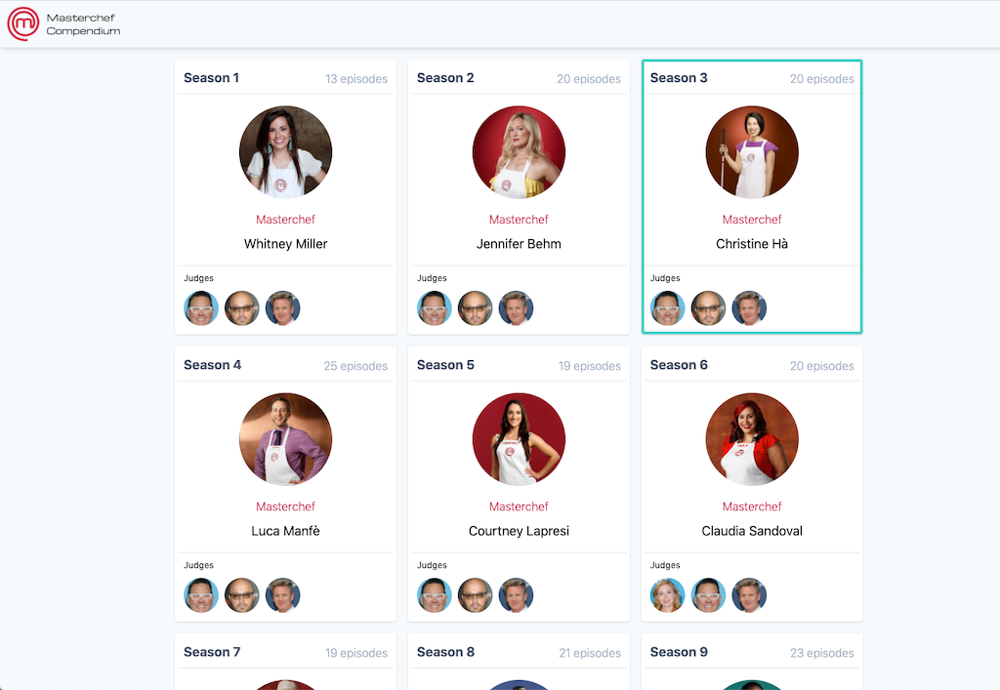
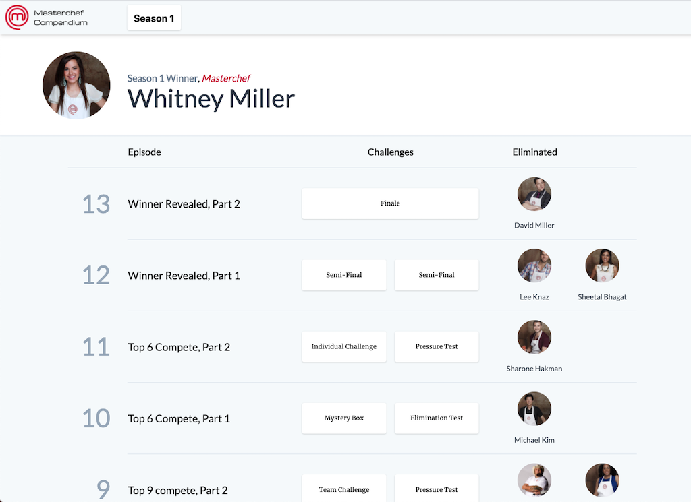

# MCC-React (Masterchef Compendium)

*Prototype of the main index*

# Overview

Masterchef Compendium (MCC). This projects aggregates recipe data with [episode challenge result data](https://github.com/goneplaid/mcc-ui/blob/master/data/processors/index.js) that was scraped [from Wikipedia](https://en.wikipedia.org/wiki/MasterChef_(American_season_1)#Elimination_table) so that it's navigable and queryable.

The data scraped from Wikipedia will be modeled with the specific recipes that each contestant has created for each challenge, along with the outcome of the challenge (how they placed).

*Season 1 episode index prototype*

# But why?

The idea is that this data can be mined to answer questions like what cooking technique for salmon has fared the best in all challenges where salmon was presented as a dish. Or, what percentage of Italian dishes has Joe Bastianich hated completely? How many have truly amazed him? What is Gordon Ramsay's consistently favored dish across all seasons of Masterchef? Is there one?

I love cooking and have always been fascinated by cooking competition shows, especially Masterchef. I created this in an effort to prepare myself if I ever wanted to sign up as a contestant, which I will probably never, ever do. Basically, if I were to prepare for this show as a contestant, I would want to focus my efforts on practicing recipes, techniques, and ingredients that have been demonstratably successful on the show.

# Getting Started with Create React App

This project was bootstrapped with [Create React App](https://github.com/facebook/create-react-app).

## Available Scripts

In the project directory, you can run:

### `yarn start`

Runs the app in the development mode.\
Open [http://localhost:3000](http://localhost:3000) to view it in the browser.

The page will reload if you make edits.\
You will also see any lint errors in the console.

### `yarn test`

Launches the test runner in the interactive watch mode.\
See the section about [running tests](https://facebook.github.io/create-react-app/docs/running-tests) for more information.

### `yarn build`

Builds the app for production to the `build` folder.\
It correctly bundles React in production mode and optimizes the build for the best performance.

The build is minified and the filenames include the hashes.\
Your app is ready to be deployed!

See the section about [deployment](https://facebook.github.io/create-react-app/docs/deployment) for more information.

### `yarn eject`

**Note: this is a one-way operation. Once you `eject`, you can’t go back!**

If you aren’t satisfied with the build tool and configuration choices, you can `eject` at any time. This command will remove the single build dependency from your project.

Instead, it will copy all the configuration files and the transitive dependencies (webpack, Babel, ESLint, etc) right into your project so you have full control over them. All of the commands except `eject` will still work, but they will point to the copied scripts so you can tweak them. At this point you’re on your own.

You don’t have to ever use `eject`. The curated feature set is suitable for small and middle deployments, and you shouldn’t feel obligated to use this feature. However we understand that this tool wouldn’t be useful if you couldn’t customize it when you are ready for it.

## Learn More

You can learn more in the [Create React App documentation](https://facebook.github.io/create-react-app/docs/getting-started).

To learn React, check out the [React documentation](https://reactjs.org/).

### Code Splitting

This section has moved here: [https://facebook.github.io/create-react-app/docs/code-splitting](https://facebook.github.io/create-react-app/docs/code-splitting)

### Analyzing the Bundle Size

This section has moved here: [https://facebook.github.io/create-react-app/docs/analyzing-the-bundle-size](https://facebook.github.io/create-react-app/docs/analyzing-the-bundle-size)

### Making a Progressive Web App

This section has moved here: [https://facebook.github.io/create-react-app/docs/making-a-progressive-web-app](https://facebook.github.io/create-react-app/docs/making-a-progressive-web-app)

### Advanced Configuration

This section has moved here: [https://facebook.github.io/create-react-app/docs/advanced-configuration](https://facebook.github.io/create-react-app/docs/advanced-configuration)

### Deployment

This section has moved here: [https://facebook.github.io/create-react-app/docs/deployment](https://facebook.github.io/create-react-app/docs/deployment)

### `yarn build` fails to minify

This section has moved here: [https://facebook.github.io/create-react-app/docs/troubleshooting#npm-run-build-fails-to-minify](https://facebook.github.io/create-react-app/docs/troubleshooting#npm-run-build-fails-to-minify)
